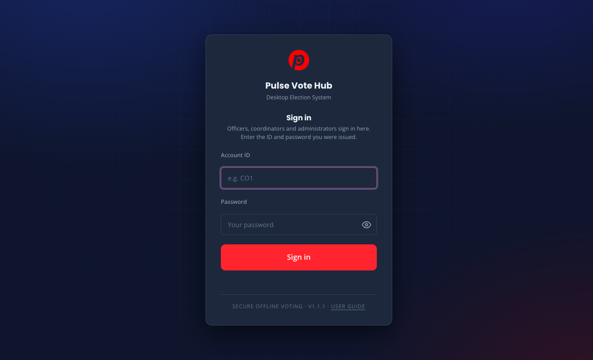
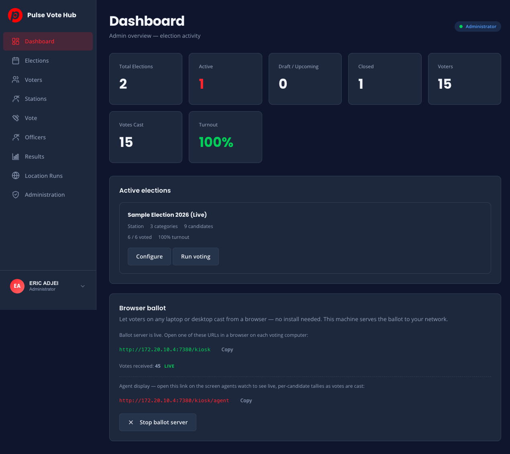
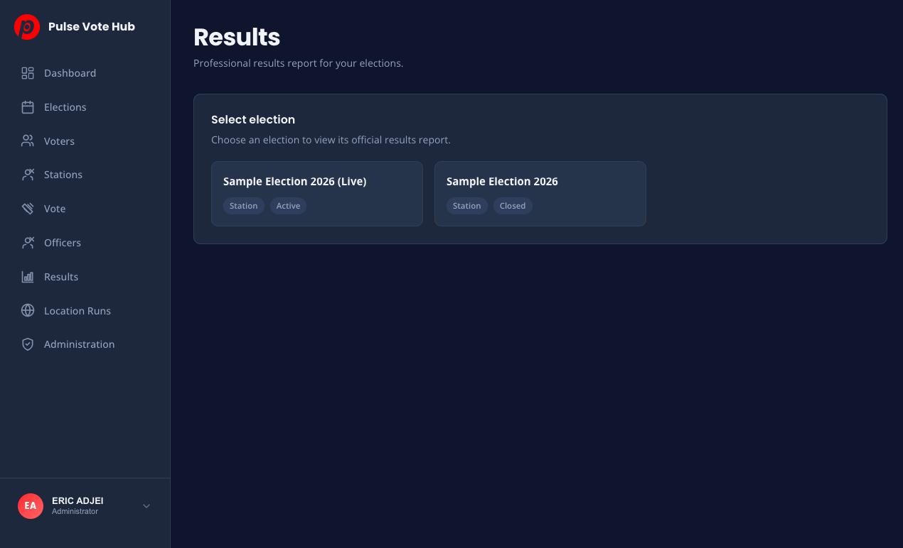

<div align="center">

  

  # Pulse Vote Hub

  **Secure, offline-first desktop voting** for school and station elections.

  Electron · SQLite · Zero cloud dependency

  Built by [Pulse Trend](https://pulse-vote-hub-app.web.app)

</div>

---

Pulse Vote Hub is a fully offline desktop election system for schools, campuses and
polling stations. Every vote, voter and setting lives only on your computers — nothing is
uploaded anywhere. Sign ballots cryptographically, merge results from multiple stations,
and run a lockdown voting kiosk on the same local network, with no internet.

## Highlights

- **Fully offline** — runs entirely on a local SQLite database; no internet required
- **Election management** — elections, positions and candidates via manual entry, CSV import or auto-generate
- **Voter management** — import voters from CSV, auto-generate credentials, print voter cards
- **Multi-station merge** — combine results from several polling stations through signature-verified file import
- **Agent live tally** — a live counting-card wall for polling agents, served over your local network
- **Duplicate prevention** — local checks stop double voting
- **Results & reporting** — in-app results with export to JSON, CSV and PDF, plus printing
- **Hardened access** — signed, sender-bound sessions; admin actions locked behind real authentication
- **LAN sync** — peer-to-peer sync protected by a shared network secret
- **Audit trail** — hash-chained votes and an immutable log of admin actions, with *Verify integrity*

## Screenshots

| Sign in | Dashboard |
| --- | --- |
|  |  |

| Results report |
| --- |
|  |

> More screenshots live in [`renderer/assets/images/guide/`](renderer/assets/images/guide/).

## Tech Stack

| | |
| --- | --- |
| **Runtime** | [Electron](https://www.electronjs.org/) |
| **Database** | SQLite ([better-sqlite3](https://github.com/WiseLibs/better-sqlite3)) |
| **Frontend** | HTML, CSS, Vanilla JavaScript |
| **Packaging** | [electron-builder](https://www.electron.build/) |

## Getting Started

```bash
# Install dependencies
npm install

# Start the app
npm start
```

## Building

```bash
# Build for Windows
npm run build:win

# Build for macOS
npm run build:mac

# Build for both
npm run build:all
```

## Project Structure

```
pulse-vote-hub-desktop/
├── electron/              # Electron main process
│   ├── main.js            # App entry, window creation, IPC
│   ├── preload.js         # Secure IPC bridge (contextIsolation)
│   ├── db.js              # SQLite layer
│   ├── auth.js            # Signed, sender-bound sessions
│   ├── lan/               # Local-network hub / peer sync
│   └── ...
├── renderer/              # Frontend (HTML/CSS/JS)
│   ├── index.html         # First-run setup & sign in
│   ├── dashboard.html     # Coordinator / admin dashboard
│   ├── vote.html          # Voting kiosk
│   ├── agent.html         # Agent live tally
│   └── ...
├── package.json
└── README.md
```

## Follow Pulse Trend

The Pulse Trends team builds open, transparent tools for classrooms, campuses and
communities. Connect with them:

| Platform | Handle |
| --- | --- |
| **Facebook** | [pulsetrendtv](https://web.facebook.com/pulsetrendtv) |
| **X (Twitter)** | [@the_pulsetrend](https://x.com/the_pulsetrend) |
| **Instagram** | [@thepulsetrend](https://instagram.com/thepulsetrend) |
| **TikTok** | [@thepulsetrend](https://tiktok.com/@thepulsetrend) |
| **YouTube** | [@thepulsetrend](https://youtube.com/@thepulsetrend) |
| **Threads** | [@the_pulsetrend](https://www.threads.com/@the_pulsetrend) |

**Website** → [pulse-vote-hub-app.web.app](https://pulse-vote-hub-app.web.app)

## License

MIT
